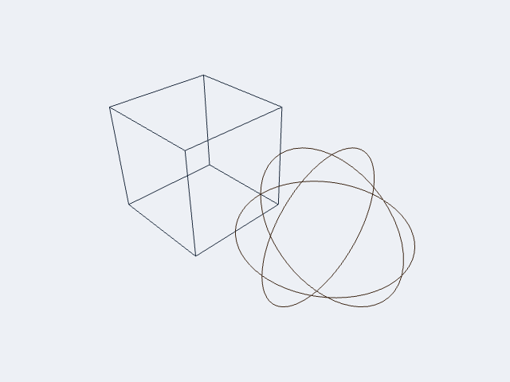
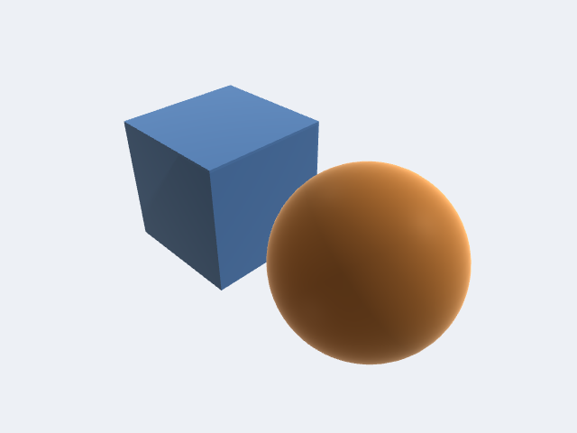
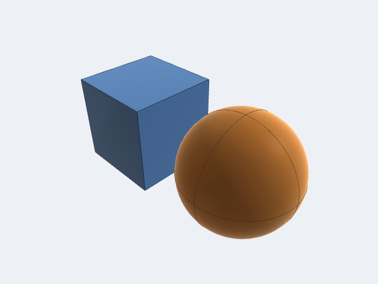
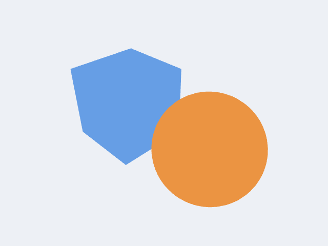

# Display Modes

`DisplayMode` controls how geometry is rendered in the viewport. Set it on
`ViewportController.displayMode` — a `@Published` property, so SwiftUI views
update automatically.

```swift
controller.displayMode = .shadedWithEdges
```

---

## Modes at a glance

| Mode | `displayName` | Surfaces | Edges | Smooth | Transparent | Shortcut |
|---|---|:---:|:---:|:---:|:---:|:---:|
| `.wireframe` | Wireframe | — | ✓ | — | — | `w` |
| `.shaded` | Shaded | ✓ | — | ✓ | — | `s` |
| `.shadedWithEdges` | Shaded + Edges | ✓ | ✓ | ✓ | — | `e` |
| `.flat` | Flat | ✓ | — | — | — | — |
| `.unlit` | Unlit | ✓ | — | ✓ | — | — |
| `.xray` | X-Ray | ✓ | ✓ | ✓ | ✓ | `x` |
| `.rendered` | Rendered | ✓ | — | ✓ | — | — |

The `showsSurfaces`, `showsEdges`, `usesSmoothShading`, and `usesTransparency`
properties on `DisplayMode` expose these flags programmatically, useful if you
are building a toolbar or binding a picker.

```swift
// Show the mode name in a label
Text(controller.displayMode.displayName)

// React to whether edges are drawn
if controller.displayMode.showsEdges {
    // ...
}
```

---

## Mode descriptions

### `.wireframe`

Draws only the polyline edge geometry — no surface fill. Useful for inspecting
mesh topology without surface occlusion. Keyboard shortcut: **W**.



### `.shaded`

Three-light Blinn-Phong + hemisphere ambient + Fresnel rim. The default and
most common mode for geometry review. Keyboard shortcut: **S**.



### `.shadedWithEdges`

Shaded surfaces with contrast-adaptive wireframe edges overlaid. Helps show
both silhouette and internal topology simultaneously. Keyboard shortcut: **E**.



### `.flat`

Shaded surfaces with flat (face-constant) normals — no smooth interpolation
across triangles. Useful for inspecting faceting, reviewing mesh density, or
achieving a cel-shaded aesthetic.

### `.unlit` — diagnostic / debug renders

Added in **v1.1.21** (issue #77). Each body is drawn in its constant base
colour with **no lighting, ambient, shadows, Fresnel rim, curvature weighting,
or tone mapping**. The interactive SSAO / ACES tone-map post-pass is skipped
entirely so it cannot re-desaturate colours after the fact.

This mode exists because the full PBR path (`shaded`) hue-shifts saturated
body colours — a bright magenta reads as greenish after ACES tone mapping, and
hemisphere ambient lifts dark hues. When colour-coding bodies for diagnostic
purposes (validation passes, per-feature heat maps, imported point data) you
need the colour you set to be the colour you see.



Clip-plane discard and the selection tint still apply in `.unlit`, so
interactive picking and highlighting work normally.

```swift
// Colour-code bodies for a diagnostic render
for (index, body) in bodies.enumerated() {
    var coded = body
    coded.color = diagnosticColor(for: index)
    controller.viewportBodies.append(coded)
}
controller.displayMode = .unlit
```

### `.xray`

Transparent surface fill with edges, so internal structure is visible through
the model. `usesTransparency` is `true` only for this mode. Keyboard shortcut:
**X**.

### `.rendered`

Nominal placeholder for a full PBR / material / texture pipeline. Defined in
the enum and accepted by `ViewportController`; the degree to which it differs
from `.shaded` in a given release is version-dependent — check the CHANGELOG
for the current state.

---

## Setting the mode

### From SwiftUI

Bind a `Picker` directly to `controller.displayMode`:

```swift
Picker("Display Mode", selection: $controller.displayMode) {
    ForEach(DisplayMode.allCases, id: \.self) { mode in
        Text(mode.displayName).tag(mode)
    }
}
.pickerStyle(.menu)
```

### From a toolbar button

```swift
Button("Wireframe") {
    controller.displayMode = .wireframe
}
```

### Cycling through modes

`ViewportController` exposes a `cycleDisplayMode()` method that steps through
all cases in declaration order — useful for a single keyboard shortcut or a
cycle button:

```swift
Button(action: controller.cycleDisplayMode) {
    Image(systemName: "circle.grid.2x2")
}
```

### Reading the keyboard shortcut

```swift
if let key = controller.displayMode.keyboardShortcut {
    Text("Shortcut: \(String(key))")
}
```

---

## Initial mode from configuration

Pass a `ViewportConfiguration` with a preset `displayMode` when constructing
the controller so the viewport opens in the right state:

```swift
var config = ViewportConfiguration()
config.displayMode = .shadedWithEdges

let controller = ViewportController(configuration: config)
```

---

## Choosing a mode

| Goal | Recommended mode |
|---|---|
| General geometry review | `.shadedWithEdges` |
| Clean presentation / screenshot | `.shaded` |
| Mesh / topology inspection | `.wireframe` |
| Colour-coded diagnostic render | `.unlit` |
| Inspect internal structure | `.xray` |
| Faceting / mesh density review | `.flat` |
