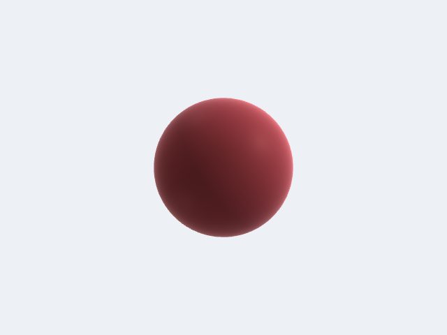
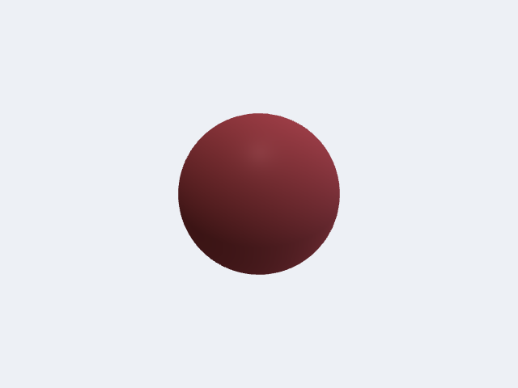
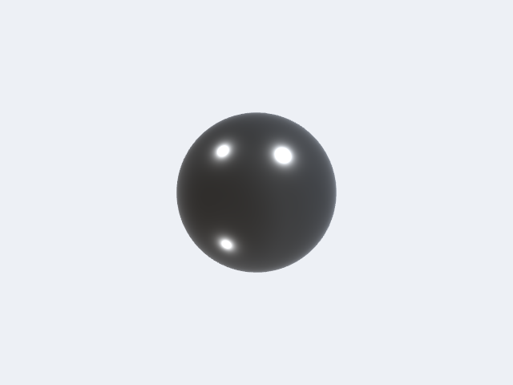
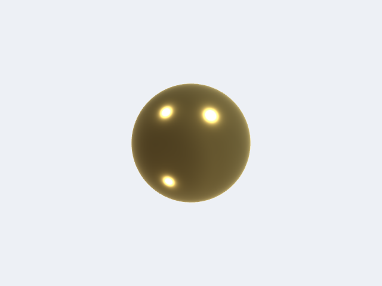
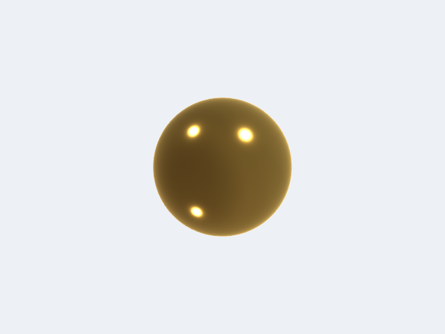
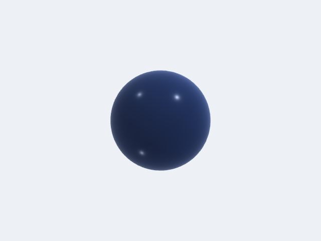

# Lighting & Materials

OCCTSwiftViewport uses a physically based rendering (PBR) pipeline with a three-directional light rig, hemisphere ambient, optional shadow mapping, Fresnel rim lighting, screen-space ambient occlusion (SSAO), and image-based lighting (IBL) from HDR environment maps. Each of these is configured through `LightingConfiguration`, which lives on `ViewportController.lightingConfiguration` and is applied every frame.

---

## Lighting Presets

Four built-in presets cover the most common CAD and visualization scenarios. Set one directly on the controller at any time:

```swift
// Apply a preset — change takes effect on the next rendered frame.
controller.lightingConfiguration = .studio
```

### `.threePoint` (default)

Classic key/fill/back rig tuned for mechanical CAD. Warm key light from upper-right-front, cool blue fill from the left, neutral back/kicker light for edge definition. SSAO radius 0.8, shadow intensity 0.2.



### `.studio`

Neutral white lights from three directions at similar intensities. Softer shadows (`shadowSoftness` 0.5), matcap blend 0.15 for a soft product-shot feel. Good for plastics and painted surfaces.


### `.architectural`

Strong warm sunlight key (intensity 1.2, warm `1.0, 0.95, 0.9`), sky-blue fill, hard shadows (`shadowSoftness` 0.2). Matches outdoor daylight conditions.


### `.flat`

Single frontal key at intensity 0.8, fill and back both disabled (intensity 0.0), ambient 0.6, shadows off, specular and Fresnel both zero. Use for technical drawings or whenever directional shading would distract.



---

## Key Controls

`LightingConfiguration` is a value type — mutate a copy and assign it back:

```swift
var lighting = controller.lightingConfiguration

// Increase shadow softness for a softer penumbra.
lighting.shadowSoftness = 0.6       // 0 = hard, 1 = soft

// Reduce shadow opacity so geometry under shadow is still readable.
lighting.shadowIntensity = 0.15     // 0 = invisible, 1 = fully opaque

// Tighten specular highlights for a shinier appearance.
lighting.specularPower = 128.0      // higher = smaller, tighter highlight
lighting.specularIntensity = 0.8    // 0–1

// Strengthen the Fresnel rim glow on silhouette edges.
lighting.fresnelPower = 2.5         // lower = broader rim
lighting.fresnelIntensity = 0.5     // 0–1

// Boost SSAO for more contact shadow depth.
lighting.ssaoRadius = 1.0
lighting.ssaoIntensity = 0.9

// Tone-mapping exposure.
lighting.exposure = 1.2             // default 1.1

controller.lightingConfiguration = lighting
```

### Individual Light Settings

Each of the three directional lights (`keyLight`, `fillLight`, `backLight`) is a `LightSettings` value:

```swift
var lighting = controller.lightingConfiguration

// Swap the fill light to a warm practical tone.
lighting.fillLight = LightSettings(
    direction: simd_normalize(SIMD3<Float>(0.6, -0.1, -0.5)),
    intensity: 0.45,
    color: SIMD3<Float>(1.0, 0.9, 0.7)   // warm amber
)

// Disable the back light entirely.
lighting.backLight.isEnabled = false

controller.lightingConfiguration = lighting
```

`LightSettings.init` defaults: `intensity` 1.0, `color` white, `isEnabled` true, `lightType` `.directional`, `position` `.zero`.

---

## Per-Body PBR Materials

`ViewportBody` has two ways to express surface appearance:

- **Simple path:** `color: SIMD4<Float>`, `roughness: Float` (default 0.5), `metallic: Float` (default 0.0). These are combined into a `PBRMaterial` internally via `effectiveMaterial`.
- **Full PBR path:** `material: PBRMaterial?`. When set, it overrides `color`/`roughness`/`metallic` entirely and unlocks clearcoat, IOR-driven Fresnel F0, and emissive channels.

### `PBRMaterial` Parameters

| Parameter | Type | Default | Notes |
|---|---|---|---|
| `baseColor` | `SIMD3<Float>` | `(0.8, 0.8, 0.8)` | Linear RGB. Albedo for dielectrics, F0 tint for metals. |
| `metallic` | `Float` | `0` | 0 = dielectric, 1 = metal. |
| `roughness` | `Float` | `0.5` | 0 = mirror, 1 = fully rough. Squared internally for GGX. |
| `ior` | `Float` | `1.5` | Index of refraction. Drives F0 for non-metals. Ignored when `metallic >= 1`. |
| `clearcoat` | `Float` | `0` | Polyurethane-like second lobe strength. 0 = none, 1 = full. |
| `clearcoatRoughness` | `Float` | `0.03` | Roughness of clearcoat layer, independent of base roughness. |
| `emissive` | `SIMD3<Float>` | `(0, 0, 0)` | Linear RGB emission color. |
| `emissiveStrength` | `Float` | `1` | Multiplier on `emissive` before tonemapping. Values > 1 produce HDR emission. |
| `opacity` | `Float` | `1` | 1 = opaque, < 1 = alpha-blended. |

### Built-in Presets

Use the static accessors directly — no string lookup required:

| Preset | `metallic` | `roughness` | Notes |
|---|---|---|---|
| `.steel` | 1 | 0.35 | Mid-grey machined steel |
| `.brushedAluminum` | 1 | 0.55 | Light grey, higher roughness |
| `.brass` | 1 | 0.30 | Gold-yellow tint |
| `.copper` | 1 | 0.30 | Pink-red tint |
| `.chromedSteel` | 1 | 0.05 | Near-mirror chrome |
| `.gold` | 1 | 0.20 | Warm yellow gold |
| `.titanium` | 1 | 0.45 | Slightly warm grey |
| `.plasticGlossy` | 0 | 0.25 | Blue-tinted, IOR 1.5 |
| `.plasticMatte` | 0 | 0.85 | Neutral grey, IOR 1.5 |
| `.paintedAutomotive` | 0 | 0.65 | Red, clearcoat 1.0, clearcoatRoughness 0.04 |
| `.rubber` | 0 | 0.95 | Near-black, very rough |
| `.glass` | 0 | 0.05 | Near-white, opacity 0.3, IOR 1.5 |

All presets are also available via `PBRMaterial.presets["key"]` and `MaterialLibrary.bundledPresets()` (as `NamedMaterial` with prettified display names).

```swift
// Assign a preset material to a body.
var body = ViewportBody(
    id: "bracket",
    vertexData: vertices,
    indices: indices,
    edges: edges,
    color: SIMD4<Float>(0.56, 0.57, 0.58, 1)
)
body.material = .steel

// Or build a custom material inline.
body.material = PBRMaterial(
    baseColor: SIMD3<Float>(0.1, 0.35, 0.1),   // dark green
    metallic: 0,
    roughness: 0.7,
    ior: 1.5
)
```






### Clearcoat Example

Clearcoat is ideal for car paint, lacquered wood, or any surface with a hard transparent top layer over a rougher base:

```swift
body.material = PBRMaterial(
    baseColor: SIMD3<Float>(0.7, 0.05, 0.05),  // red
    metallic: 0,
    roughness: 0.65,
    ior: 1.5,
    clearcoat: 1.0,
    clearcoatRoughness: 0.04
)
// Equivalent to PBRMaterial.paintedAutomotive (with a different baseColor).
```

### Emissive Example

`emissiveStrength` values above 1 are HDR; they will bloom through the tonemapper:

```swift
body.material = PBRMaterial(
    baseColor: SIMD3<Float>(0.05, 0.05, 0.05),
    metallic: 0,
    roughness: 0.9,
    emissive: SIMD3<Float>(1.0, 0.4, 0.0),     // orange glow
    emissiveStrength: 3.0
)
```

### Semi-transparent Body

Combine `opacity < 1` with the `.glass` preset (or any material) to produce alpha-blended geometry. The renderer automatically sorts transparent bodies back-to-front:

```swift
var cover = ViewportBody(
    id: "cover",
    vertexData: coverVerts,
    indices: coverIndices,
    edges: [],
    color: SIMD4<Float>(0.95, 0.97, 0.98, 0.3)  // ignored when material is set
)
cover.material = .glass   // baseColor (0.95,0.97,0.98), opacity 0.3 built in
```

---

## Image-Based Lighting (HDR Environment Maps)

Supplying an HDR environment map upgrades ambient and specular contributions from the three-point rig to full image-based lighting: the renderer generates a prefiltered specular mip chain (128 px cube, 8 mip levels), a 32 px diffuse irradiance map, and a BRDF integration LUT — all on the GPU at load time.

### Loading from a `.hdr` File URL

Set `environmentMapURL` in the lighting configuration. The renderer calls `HDRLoader.loadFromURL(_:)` (Radiance RGBE `.hdr`/`.rgbe`/`.pic`) and uploads the result automatically:

```swift
guard let url = Bundle.main.url(forResource: "studio_garden_2k", withExtension: "hdr") else {
    return
}

var lighting = controller.lightingConfiguration
lighting.environmentMapURL = url
lighting.environmentIntensity = 1.0   // IBL contribution multiplier
lighting.drawBackground = true        // render the map as a skybox background
lighting.backgroundExposure = 0.8     // darken background without dimming lighting
lighting.environmentRotationY = .pi / 4  // rotate environment 45° around Y
controller.lightingConfiguration = lighting
```

`environmentIntensity` scales the IBL contribution independently of the three directional lights. `drawBackground` controls whether the cubemap is rendered as the scene background; turning it off leaves a solid clear colour while IBL lighting still applies to geometry.

### Rotating the Environment

`environmentRotationY` (radians, range 0…2π) rotates reflections and lighting without moving scene geometry. This lets you align a key reflection with a product silhouette:

```swift
lighting.environmentRotationY = .pi   // rotate 180°
controller.lightingConfiguration = lighting
```

### Combining IBL with the Directional Rig

IBL and the three-point rig are additive. A common product-shot setup suppresses the directional lights and relies entirely on the environment:

```swift
var lighting = LightingConfiguration.studio
lighting.keyLight.intensity = 0.0
lighting.fillLight.intensity = 0.0
lighting.backLight.intensity = 0.0
lighting.ambientIntensity = 0.0
lighting.environmentMapURL = hdrlUrl
lighting.environmentIntensity = 1.2
lighting.drawBackground = true
lighting.backgroundExposure = 0.4   // dark background, bright lighting
controller.lightingConfiguration = lighting
```

### Using `ViewportConfiguration`

`lightingConfiguration` is also a field on `ViewportConfiguration`, so you can set it at construction time before handing the config to a `ViewportController`:

```swift
var config = ViewportConfiguration()
config.lightingConfiguration = .architectural
let controller = ViewportController(configuration: config)
```

The default `ViewportConfiguration.init` passes `.threePoint` as the lighting default.
